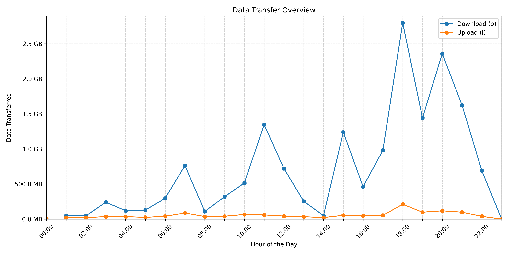

# Dhiraagu Fiber Usage Charts
---
## DISCLAIMER
> This script is not affiliated or endorsed by [DHIRAAGU (Dhivehi Raajjeyge Gulhun Plc)](https://www.dhiraagu.com.mv) or any of its affiliates.

The script is provided as is and without any guarantees or warranties.

I am not responsible for any repercussions, errors or losses that are incurred from the use of this script. Be responsible and check the code before using it.

---

Python script to generate Dhiraagu Fiber Usage Charts and send it to you via Telegram.

## Usage

### Installation

1. Clone the repository
2. Install the required packages using `pip install -r requirements.txt`
3. Create config file and put in your credentials.

### Usage

1. Run the script using `python main.py`
2. The script will generate a png of the chart and send it to you via Telegram.

### Sample

